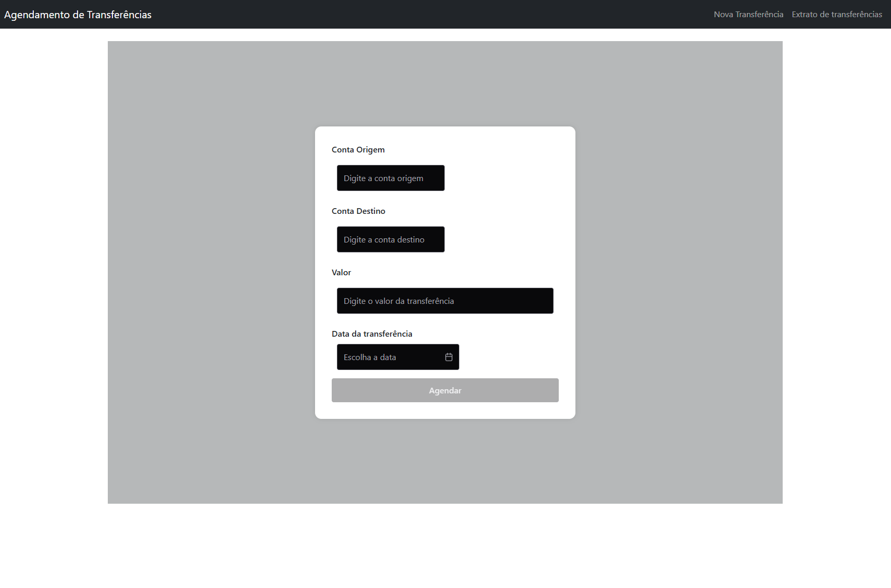
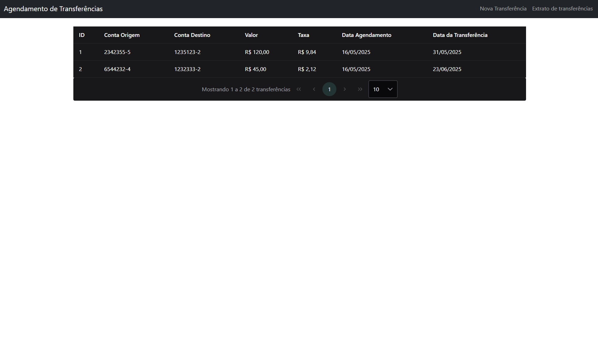

# 💸 App para Agendamento de Transferências

Esta aplicação permite o agendamento de transferências financeiras entre contas, com cálculo automático de taxas, datas e validações completas. Desenvolvida com **Spring Boot (Java 11)** no backend e **Angular 19 + PrimeNG** no frontend.

---

## 📦 Tecnologias Utilizadas

### Backend (Java 11 + Spring Boot)
- Spring Web
- Spring Data JPA
- H2 Database (em memória)
- Lombok
- CORS Configuration

### Frontend (Angular 19)
- Angular Standalone APIs
- PrimeNG 19.1.3
- PrimeIcons
- Formulários Reativos com Validação
- InputMask e InputNumber
- Responsividade com SCSS

---

## 🚀 Como Executar

### Backend

```bash
cd backend
./mvnw spring-boot:run
```

O backend estará disponível em: `https://github.com/VtOliv/Transferencias-Service`

Endpoints:
- `GET /transfers` → lista todas as transferências
- `POST /transfers` → agendar nova transferência

### Frontend

```bash
cd frontend
npm install
npm run start
```

O frontend estará disponível em: `http://localhost:4200`

---

## 📋 Funcionalidades

- ✅ Cadastro de transferências com:
  - Conta de origem e destino com máscara (XXXXXXX-X)
  - Valor com máscara monetária brasileira
  - Validação de campos obrigatórios
  - Data futura de transferência

- ✅ Listagem das transferências já agendadas

- ✅ Taxa calculada automaticamente de acordo com as regras definidas no backend

- 🌐 Suporte ao idioma e formatação `pt-BR`

---

## 🖥️ Estrutura do Projeto

```
transfers-app/
├── backend/
│   ├── src/main/java/... (Spring Boot)
│   └── application.properties
├── frontend/
│   ├── src/app/
│   │   ├── transfer-form/ (Formulário)
│   │   ├── transfer-list/ (Tabela)
│   │   └── app.routes.ts / app.component.ts
│   └── styles.scss
```

---

## 📷 Capturas de Tela

### Formulário
> Agende novas transferências com validação e máscara


### Lista
> Visualize as transferências já programadas

---

## 🤝 Contribuição

Sinta-se à vontade para abrir PRs, relatar bugs ou sugerir melhorias.

---
